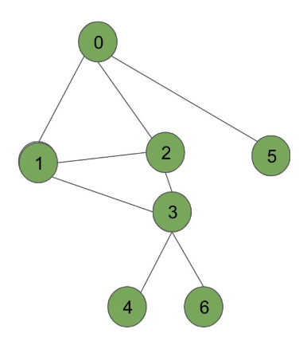

# Non-recursive-DFS
Implement the non-recursive version of DFS algorithm.

take a vertex called root as the starting point, and should output a vector containing the nodes that it visits in DFS order.

Input graph:



Output: [0, 1, 2, 3, 4, 6, 5]

Run with
```
bazel run src/main:main
```

Test with
```
bazel test tests:tests
```


